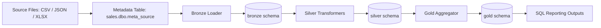

# Lead Data Engineer Assessment Solution

## 1) What This Solution Does
This project implements an end-to-end sales data pipeline using a medallion architecture pattern:

- Bronze: raw ingestion from source files
- Silver: cleaned, deduplicated, enriched datasets
- Gold: business-ready aggregate table for analytics

The implementation is in Data_Processing.ipynb and loads data into SQL Server schemas (bronze, silver, gold), then runs analytical SQL outputs required by the assessment.

## 2) Architecture Overview (Metadata-Driven Medallion)
The pipeline follows a metadata-driven design where source ingestion is controlled by entries in sales.dbo.meta_source (source_name, source_type, source_path), instead of hardcoding file handling per table.



## 3) Why This Is Modular and Scalable
### Modular
Each stage is split into reusable functions with clear responsibilities:

- Connectivity and config
  - build_connection_string
  - create_connection
- Bronze ingestion
  - read_source_file
  - sanitize_columns
  - create_bronze_table
  - insert_into_bronze
  - load_sources_to_bronze
- Silver transformation/enrichment
  - ensure_schema
  - read_sql_table
  - deduplicate_dataframe
  - create_table_from_df
  - insert_dataframe
  - load_bronze_to_silver
  - load_enriched_orders_to_silver
- Gold aggregation
  - grouped aggregation into gold.agg_profit_by_year_category_subcategory_customer

This separation makes unit testing straightforward and localizes changes when logic evolves.

### Scalable
The architecture scales in practical ways:

- New source onboarding requires metadata row updates, not orchestration rewrites.
- Column resolution is defensive (candidate-based matching), reducing schema-coupling.
- Generic DDL/dataframe loaders are reused across bronze/silver/gold.
- Dedup and enrichment are reusable and parameter-driven.
- Analytics queries consume stable gold outputs rather than raw operational tables.

## 4) Pipeline Walkthrough
### Step A: Connection Setup
The notebook builds an ODBC SQL Server connection string using either:

- Windows integrated auth (Trusted_Connection=yes), or
- SQL auth (UID/PWD when provided)

### Step B: Bronze Ingestion
- Source metadata is read from sales.dbo.meta_source.
- Each source is loaded by source type.
- Columns are sanitized for SQL compatibility.
- Bronze tables are recreated based on dataframe schema and loaded in bulk.

### Step C: Silver Layer
- silver.customer and silver.products are loaded from bronze with dedup logic.
- silver.orders is enriched by joining orders with customer and product dimensions.
- Profit is coerced to numeric and rounded to 2 decimals.

### Step D: Gold Layer
- Data is grouped by Year, Product Category, Product Sub Category, and Customer.
- Output table:
  - gold.agg_profit_by_year_category_subcategory_customer

### Step E: SQL Analytical Outputs
The notebook then produces:

- Profit by Year
- Profit by Year + Product Category
- Profit by Customer
- Profit by Customer + Year

## 5) Metadata-Driven Behavior Details
The key metadata pattern is this query in ingestion:

- SELECT source_name, source_type, source_path FROM sales.dbo.meta_source

This allows the bronze loader to process an arbitrary set of sources dynamically. In production, onboarding a new source should mostly be a metadata operation plus validating schema compatibility.

## 6) Error Handling and Data Quality
The notebook includes safeguards:

- Required connection fields are validated.
- Unsupported source formats raise explicit errors.
- Load blocks use try/except with rollback on failures.
- Dedup gracefully falls back when expected key columns are missing.
- Required enrichment columns are validated through dynamic candidate matching.

## 7) Testing Strategy
A comprehensive pytest suite is provided:

- tests/test_data_processing_notebook.py

Coverage includes:

- connection string behavior and validation
- source file dispatch and unsupported format handling
- column sanitization
- DDL generation and insert behavior
- dedup logic paths
- dynamic column resolution behavior
- silver load success/failure transaction behavior
- enrichment logic (joins, rounding, rollback path)

Run tests:

```bash
pytest -q
```

## 8) Business Assumptions
To keep transformation and reporting logic consistent, the following business assumptions were used:

- Each order line is treated as an atomic business event (profit is aggregated from line level, not order header level).
- Missing customer/category values in reporting are grouped under "Unknown" where SQL outputs use COALESCE.
- Deduplication keeps the first occurrence for business keys when provided; records not matching key expectations fall back to full-row deduplication.

## 9) Notes on Alignment with the Problem Statement
The problem statement asks for PySpark. This submission implements the same medallion and metadata-driven design using pandas + SQL Server for execution in the current environment.

Design intent remains aligned:

- staged medallion data model
- metadata-driven ingestion
- enrichment and quality controls
- required aggregate outputs
- automated unit tests
